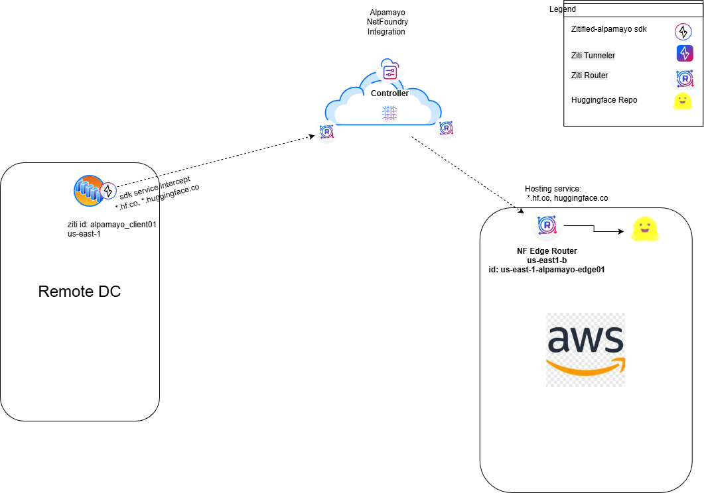
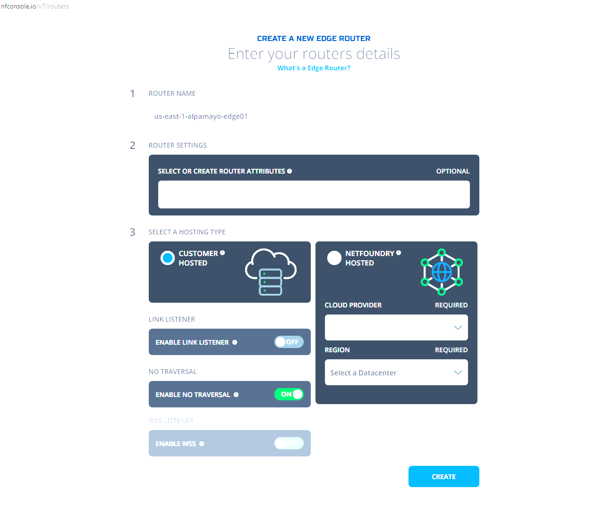
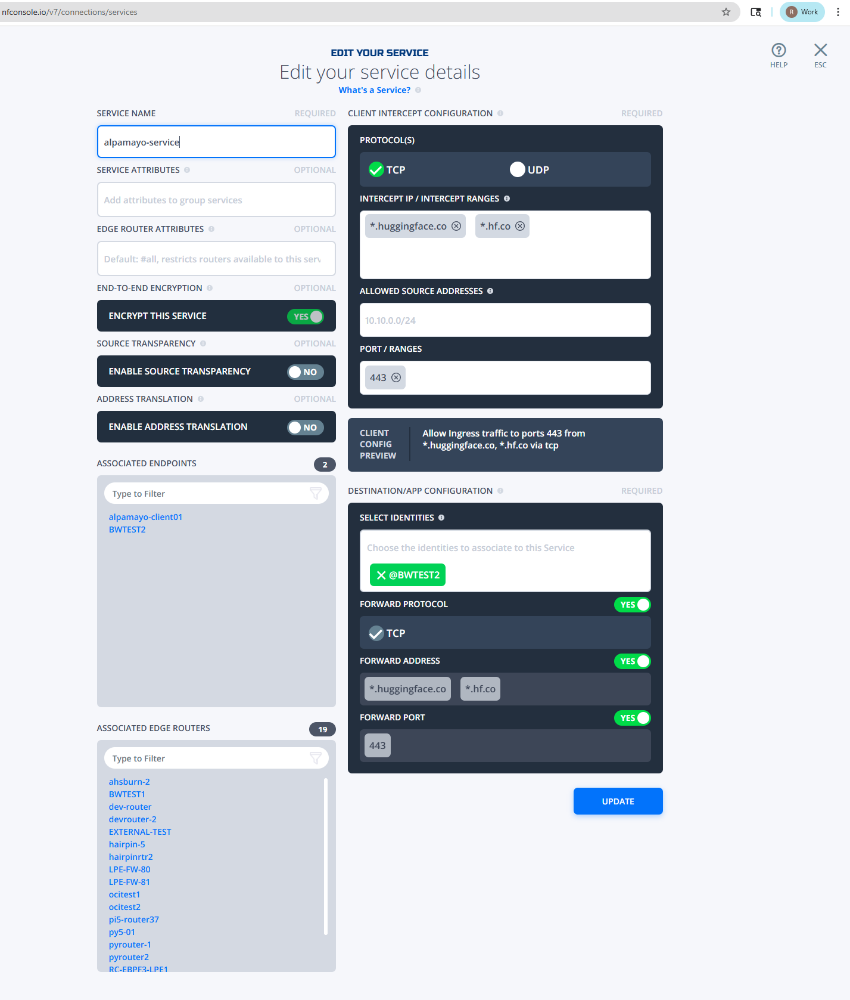
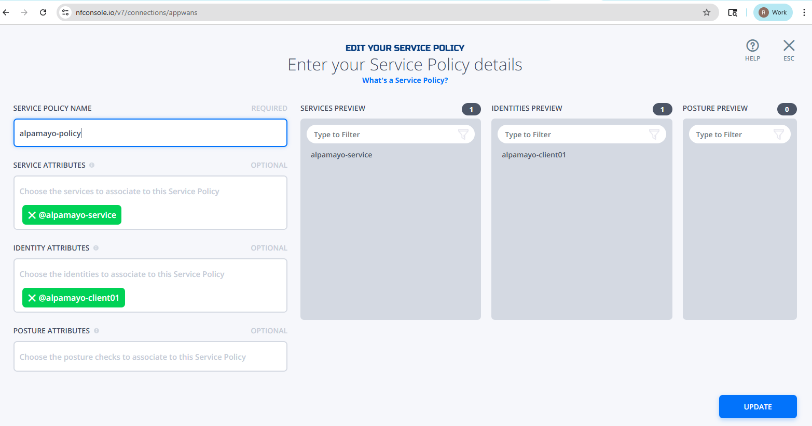
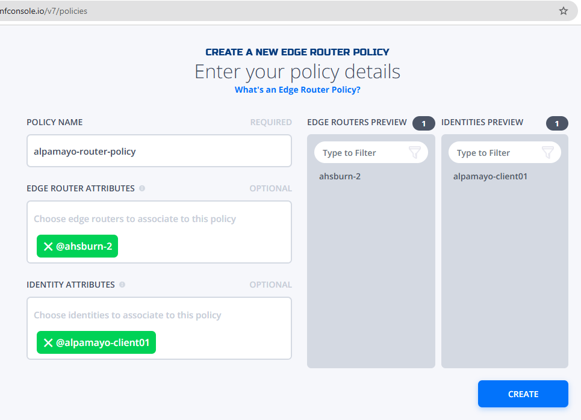

<div align="center">

# 🏔️ Alpamayo 1
This Repository is a fork of the original NVIDIA Alpamayo 1 project with an example
zitification of the original inference test. This README has been modified with instructions
to setup and run the zitified version over a NetFoundry Network.

### Bridging Reasoning and Action Prediction for Generalizable Autonomous Driving

[](https://huggingface.co/nvidia/Alpamayo-R1-10B)
[](https://arxiv.org/abs/2511.00088)
[](./LICENSE)

</div>

_Note: Following the release of [NVIDIA Alpamayo](https://nvidianews.nvidia.com/news/alpamayo-autonomous-vehicle-development) at CES 2026, Alpamayo-R1 has been renamed to Alpamayo 1._

## Setup and Configure the Example



Create or use an existing ziti network with at least one NF hosted edge router. This can be accomplished using the NetFoundry
Console.

## 1. Install prereqs

On an ubuntu 24.04 system with an NVidia GPU that meets the Alpamayo
   hardware requirements
   a. install prereqs 

```bash
sudo apt update
sudo apt upgrade
sudo apt install git
#if not installed
curl -LsSf https://astral.sh/uv/install.sh | sh
export PATH="$HOME/.local/bin:$PATH
sudo apt-get install -y nvidia-cuda-toolkit  
```

   b. ## Build the Example
      On the linux system that will run the Client
      mkdir ~/repos
      cd repos
      git clone https://github.com/NVlabs/alpamayo.git

## 2. Create a client side Netfoundry Idenetity 

Create and enroll a ziti identity place the identity json file in the ~/repos/alpamayo/src on the ubuntu system in step 1.
   ```
   a. alpamayo_client01.json
   ```

## 3. Add a customer hosted edge router e.g. "us-east-1-alpamayo-edge01" to your network



## 4. Launch the customer hosted edge-router in aws region e.g. us-east-1 
a. follow: https://support.netfoundry.io/hc/en-us/articles/   360016342971-Deployment-Guide-for-AWS-Edge-Routers 

## 5. Create a NF service named "alpqamayo-service" and use wildcard address "*.hf.co" and *.huggingface.co , protocol TCP and 443 as the
port. Assign the router identity e.g. us-east-1-alpamayo-edge01 as the hosting entity and forward address, protocol and port to yes.
 

5. Create a service policy to bind the identity to the NF service e.g.



## 6. Create a router policy and with the NF hosted edge-router and the alpamayo_client01 as the identity e.g.




### 7. Set up the virtual environment

```bash
uv venv ar1_venv
source ar1_venv/bin/activate
uv sync --active
uv pip uninstall hf-xet #Remove Hugging Face storage acceleration layer (Bypasses OpenZiti interception)
```

### 4. Authenticate with HuggingFace

The model requires access to gated resources. Request access here:
- 🤗 [Physical AI AV Dataset](https://huggingface.co/datasets/nvidia/PhysicalAI-Autonomous-Vehicles)
- 🤗 [Alpamayo Model Weights](https://huggingface.co/nvidia/Alpamayo-R1-10B)

Then authenticate:

```bash
hf auth login
```

Get your token at: https://huggingface.co/settings/tokens

## Running Inference

### Test script

NOTE: This script will download both some example data (relatively small) and the model weights (22 GB).
The latter can be particularly slow depending on network bandwidth. **The script will download the model over openziti
note the 22GB will be sent over your Cloud/NetFoundry network so be aware of associated data costs. Also not the model will be
cached in ~/.cache/huggingface/hub in sub-directories after the first download**.

```bash
python src/alpamayo_r1/ztest_inference.py
```

In case you would like to obtain more trajectories and reasoning traces, please feel free to change
the `num_traj_samples=1` argument to a higher number (Line 60).

### Interactive notebook

We provide a notebook with similar inference code at `notebook/inference.ipynb`.

## Project Structure

```
alpamayo/
├── notebook/
│   └── inference.ipynb                  # Example notebook
├── src/
│   └── alpamayo_r1/
│       ├── action_space/
│       │   └── ...                      # Action space definitions
│       ├── diffusion/
│       │   └── ...                      # Diffusion model components
│       ├── geometry/
│       │   └── ...                      # Geometry utilities and modules
│       ├── models/
│       │   ├── ...                      # Model components and utils functions
│       ├── __init__.py                  # Package marker
│       ├── config.py                    # Model and experiment configuration
│       ├── helper.py                    # Utility functions
│       ├── load_physical_aiavdataset.py # Dataset loader
│       ├── test_inference.py            # Inference test script
        ├── ztest_inference.py           # zitified Inference test script
├── pyproject.toml                       # Project dependencies
└── uv.lock                              # Locked dependency versions
```

## Troubleshooting

### Flash Attention issues

The model uses Flash Attention 2 by default. If you encounter compatibility issues:

```python
# Use PyTorch's scaled dot-product attention instead
config.attn_implementation = "sdpa"
```

## License

Apache License 2.0 - see [LICENSE](./LICENSE) for details.

## Disclaimer

Alpamayo 1 is a pre-trained reasoning model designed to accelerate research and development in the autonomous vehicle (AV) domain. It is intended to serve as a foundation for a range of AV-related use cases-from instantiating an end-to-end backbone for autonomous driving to enabling reasoning-based auto-labeling tools. In short, it should be viewed as a building block for developing customized AV applications.

Important notes:

- Alpamayo 1 is provided solely for research, experimentation, and evaluation purposes.
- Alpamayo 1 is not a fully fledged driving stack. Among other limitations, it lacks access to critical real-world sensor inputs, does not incorporate required diverse and redundant safety mechanisms, and has not undergone automotive-grade validation for deployment.

By using this model, you acknowledge that it is a research tool intended to support scientific inquiry, benchmarking, and exploration—not a substitute for a certified AV stack. The developers and contributors disclaim any responsibility or liability for the use of the model or its outputs.
